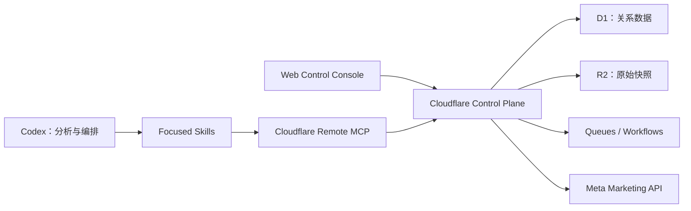

# Facebook Ads Codex

以 Codex 为唯一 AI 交互入口、以 Cloudflare 为数据与执行控制平面的
Facebook/Meta 广告管理和分析系统。

> **当前状态：文档基线完成，Phase 0 尚未启动。**
>
> 仓库目前没有可运行代码、已部署资源或已授权的 Meta 写能力。

## 项目目标

本项目计划让 Codex 能够：

- 安全读取多个 Meta 广告账户的数据。
- 统一 Campaign、Ad Set 和 Ad 层级的指标口径。
- 生成日报、异常诊断和有证据支持的优化建议。
- 将建议转换为可审计的变更申请。
- 在人工审批和策略校验后执行有限写操作。
- 仅在长期 Dry Run 验证后开放有边界的自动化。

规范性需求、安全边界和阶段 Gate 以
[`docs/FACEBOOK_ADS_CODEX_EXECUTION_SPEC.md`](docs/FACEBOOK_ADS_CODEX_EXECUTION_SPEC.md)
为唯一事实来源。

## 当前状态

| 项目 | 状态 |
| --- | --- |
| 规范版本 | `1.0.0` |
| 当前阶段 | Pre-Phase 0 |
| 初始运行模式 | `READ_ONLY` |
| 生产部署授权 | 未授权 |
| Meta 写操作授权 | 未授权 |
| 可运行实现 | 尚无 |
| 项目许可证 | 尚未确定 |

## 架构概览



- Codex 负责理解、推理、分析、建议和工具编排。
- Cloudflare 负责认证、授权、同步、存储、任务执行和审计。
- 网页控制台负责连接配置、数据状态、审批和紧急停止，不是聊天入口。
- Cloudflare 账户边界和 Meta 业务租户边界独立建模。

详细说明见 [`docs/architecture/overview.md`](docs/architecture/overview.md)。

## 文档导航

| 文档 | 用途 |
| --- | --- |
| [执行规范](docs/FACEBOOK_ADS_CODEX_EXECUTION_SPEC.md) | 唯一规范性需求、架构、安全和 Gate |
| [文档索引](docs/README.md) | 文档分类、权威级别和维护规则 |
| [架构概览](docs/architecture/overview.md) | 系统组件、边界和数据流 |
| [实施路线图](docs/roadmap.md) | Phase 0–5 与 Gate 摘要 |
| [Phase 0 问卷](docs/planning/phase-0-questionnaire.md) | 业务、权限和数据口径确认模板 |
| [ADR 索引](docs/decisions/README.md) | 已接受架构决策及新增 ADR 方式 |
| [术语表](docs/glossary.md) | 项目核心业务和技术术语 |
| [Runbook 索引](docs/runbooks/README.md) | 后续运维手册清单与完成条件 |
| [贡献指南](CONTRIBUTING.md) | 变更流程和文档规范 |
| [安全策略](SECURITY.md) | 威胁模型、安全不变量和漏洞报告方式 |
| [变更日志](CHANGELOG.md) | 文档和实现版本变化 |

## 开始工作

当前不需要安装依赖，也没有本地服务可启动。开始实施前：

1. 完整阅读[执行规范](docs/FACEBOOK_ADS_CODEX_EXECUTION_SPEC.md)。
2. 确认当前工作区没有需要保留或协调的变更。
3. 回答 [Phase 0 问卷](docs/planning/phase-0-questionnaire.md)。
4. 使用规范中的启动语句明确授权当前阶段：

```text
按照 docs/FACEBOOK_ADS_CODEX_EXECUTION_SPEC.md 开始执行 Phase 0。
```

每次只能实施一个阶段，不得提前实现后续阶段，也不得把阶段启动理解为生产部署或
Meta 写操作授权。

## 核心安全边界

- 不得把 Token、Authorization Header 或密钥写入仓库、日志、R2、浏览器或 Skill。
- 所有业务数据查询必须由服务端执行工作空间隔离和权限校验。
- 网页和 MCP 不得提供任意 Meta Graph API、任意 URL 或任意 SQL 能力。
- 外部广告写操作必须基于已批准且未过期的不可变变更申请。
- Emergency stop 默认开启；未配置安全策略时必须安全失败。

完整、规范性的安全要求见执行规范第 12、13、16 和 19.4 节。
