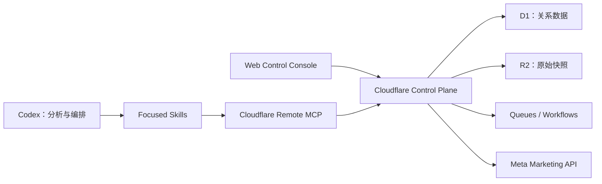

# Facebook Ads Codex

以 Codex 为唯一 AI 交互入口、以 Cloudflare 为数据与执行控制平面的
Facebook/Meta 广告管理和分析系统。

> 当前只完成模块化文档基线，项目尚未进入 Phase 0，也没有可运行的业务代码。
>
> 当前阶段和授权以[项目状态与授权](docs/project/status-and-authorizations.md)为准。

## 项目目标

本项目计划让 Codex 能够：

- 安全读取多个已授权 Meta 广告账户的数据。
- 统一 Campaign、Ad Set 和 Ad 层级的指标口径。
- 生成日报、异常诊断和有证据支持的优化建议。
- 将建议转换为可审计的变更申请。
- 仅在人工审批和策略校验后执行有限写操作。
- 仅在长期 Dry Run 后开放有边界的自动化。

范围和不可变边界见[项目章程](docs/project/charter.md)。

## 架构概览



- Codex 负责理解、推理、分析、建议和工具编排。
- Cloudflare 负责认证、授权、同步、存储、执行和审计。
- 网页控制台负责连接、状态、审批和 Emergency stop，不是聊天入口。
- Cloudflare 账户、Workspace 和 Meta 业务租户独立建模。

详细设计见[系统架构](docs/technical/architecture.md)。

## 文档导航

| 入口 | 用途 |
| --- | --- |
| [项目文档](docs/README.md) | 权威矩阵、任务阅读路径和完整导航 |
| [项目状态与授权](docs/project/status-and-authorizations.md) | 当前阶段和授权事实源 |
| [需求文档](docs/requirements/README.md) | 产品、功能、质量、角色、指标和追踪 |
| [技术文档](docs/technical/README.md) | 架构、数据、Meta、MCP、审批和安全设计 |
| [工程规范](docs/standards/README.md) | 代码、接口、数据、安全、测试和发布规则 |
| [ADR](docs/decisions/README.md) | 已接受的长期架构决策 |
| [路线图](docs/planning/roadmap.md) | Phase 0–5 和 Gate |
| [安全策略](SECURITY.md) | 安全政策、威胁和报告范围 |
| [贡献指南](CONTRIBUTING.md) | 变更和评审流程 |

## 开始工作

当前不需要安装业务依赖或启动服务。开始任何工作前：

1. 阅读[项目文档入口](docs/README.md)中的通用阅读清单。
2. 确认[项目状态与授权](docs/project/status-and-authorizations.md)允许目标动作。
3. 检查并保留工作区已有变更。
4. 只实施当前明确授权的阶段。

Phase 0 只有在项目负责人使用状态文档中的明确启动语句后才开始。

## 文档校验

安装开发依赖后运行：

```bash
npm run docs:check
```

该命令检查 Markdown、内部链接、元数据、稳定 ID、需求追踪和常见敏感信息。

## 核心安全边界

- Token、Authorization Header 和密钥不得进入仓库、日志、R2、浏览器或 Skill。
- 所有业务查询必须由服务端执行 Workspace 隔离和权限校验。
- 网页和 MCP 不得提供任意 Meta Graph API、URL 或 SQL 能力。
- 外部写操作必须基于已批准且未过期的不可变变更申请。
- Emergency stop 默认开启；缺少安全策略时必须安全失败。

完整政策见 [SECURITY.md](SECURITY.md)。
