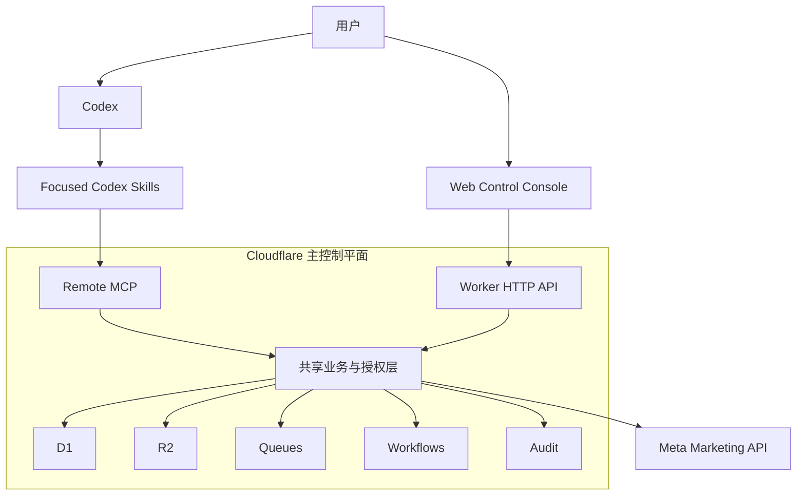
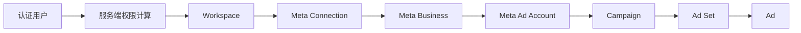
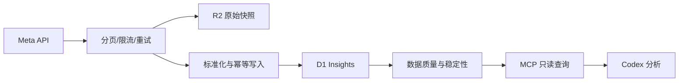
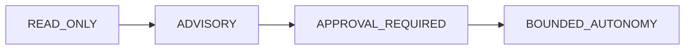

# 架构概览

> **权威级别：派生说明。**
>
> 本文依据执行规范 `v1.0.0` 整理，最后复核日期为 2026-07-29。发生冲突时以
> [`../FACEBOOK_ADS_CODEX_EXECUTION_SPEC.md`](../FACEBOOK_ADS_CODEX_EXECUTION_SPEC.md)
> 为准。

## 设计目标

系统将 AI 推理与确定性的认证、授权、数据和执行控制分离：

- Codex 是唯一 AI Agent 和日常交互入口。
- Cloudflare 是单一主控制平面。
- 网页控制台提供配置、可视化、审批和紧急停止。
- Meta Marketing API 是外部数据源和后续受控写入目标。

## 组件关系

## 组件职责

| 组件 | 负责 | 不负责 |
| --- | --- | --- |
| Codex | 理解、分析、诊断、建议、报告和工具编排 | 保存密钥、直接绕过审批写 Meta |
| Focused Skills | 流程、指标定义、诊断顺序、格式和安全规则 | 实时认证、租户授权、Token |
| Remote MCP | 实时数据、服务端授权和受控操作 | 任意 SQL、任意 URL、任意 Graph API |
| Worker 业务层 | 认证、RBAC、租户隔离、策略、执行和审计 | 第二个独立聊天 Agent |
| Web Console | 配置、状态、图表、审批、审计和 Emergency stop | AI 对话、浏览器直连 Meta |
| D1 | 关系状态、标准化指标、审批和审计索引 | 明文租户 Token |
| R2 | 不可变原始快照、导出和 before/after 快照 | Authorization Header、会话信息 |
| Queues/Workflows | 异步同步、重试、回补和长任务 | 依赖 Codex 客户端在线 |

## 租户与信任边界

关键不变量：

- Cloudflare 账户不是 Meta 租户，两者不得默认一对一。
- 所有业务表和查询都必须在服务端应用 `workspace_id`。
- 外部 Meta ID 必须与 `workspace_id` 共同确定唯一作用域。
- 客户端或模型传入的角色和对象 ID 不是授权证据。
- 默认拒绝跨工作空间访问。

## 数据生命周期

- 日内同步负责花费、展示、点击和对象状态。
- 每日回补最近 7 天，以捕获延迟归因变化。
- 初始回填默认 180 天，但必须由 Phase 0 确认。
- 数据状态按 `PROVISIONAL -> RECONCILING -> STABLE` 演进。
- 当前日和归因回补窗口内的数据不能标记为 `STABLE`。

## 能力开放顺序

任何阶段都不能跳过。阶段启动不自动授权生产部署或 Meta 写操作。

## MVP 技术基线

| 领域 | 选择 |
| --- | --- |
| 语言 | TypeScript |
| 运行时 | Cloudflare Workers |
| Web | React + Vite |
| API 与 MCP | 一个 Worker 项目 |
| 关系存储 | D1 |
| 原始存储 | R2 |
| 异步处理 | Queues + Workflows |
| 验证 | Schema-first runtime validation |
| 测试 | Unit、integration、end-to-end |

MVP 默认保持单体控制平面，只有出现明确的部署、权限或扩展需要时才考虑拆分。
