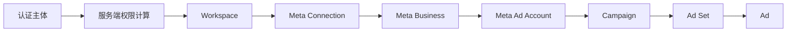
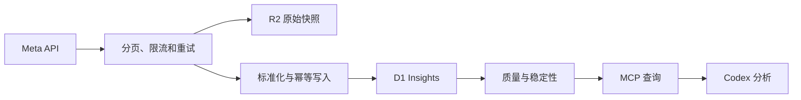
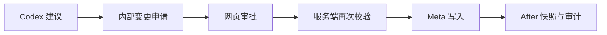

# 系统架构

## 设计目标

系统将 AI 推理与确定性的身份、数据、策略和外部执行分离：

- Codex 是唯一 AI Agent 和日常自然语言入口。
- Cloudflare 是单一主控制平面。
- Web Control Console 提供配置、状态、审批、审计和紧急停止。
- Meta Marketing API 是外部数据源及后续受控写入目标。

这些边界由 [ADR-001](../decisions/ADR-001-codex-only-ai-agent.md)、
[ADR-002](../decisions/ADR-002-web-is-not-ai-entry.md)和
[ADR-005](../decisions/ADR-005-single-control-plane.md)约束。

## 组件关系

```mermaid
flowchart TB
  User["用户"] --> Codex["Codex"]
  User --> Console["Web Control Console"]

  Codex --> Skills["Focused Codex Skills"]
  Skills --> MCP["Remote MCP"]
  Console --> HTTP["Worker HTTP API"]

  subgraph CF["Cloudflare 主控制平面"]
    MCP --> Domain["共享业务与授权层"]
    HTTP --> Domain
    Domain --> D1["D1"]
    Domain --> R2["R2"]
    Domain --> Queues["Queues"]
    Domain --> Workflows["Workflows"]
    Domain --> Audit["Audit"]
  end

  Domain --> Meta["Meta Marketing API"]
```



## 组件职责

| 组件 | 负责 | 不负责 |
| --- | --- | --- |
| Codex | 理解、分析、诊断、建议、报告和工具编排 | 密钥保存、绕过审批写 Meta |
| Focused Skills | 流程、指标、诊断顺序、输出和安全规则 | 实时认证、租户授权、Token |
| Remote MCP | 实时数据、服务端授权和受控工具 | 任意 SQL、URL、Graph API |
| Worker 业务层 | 认证、RBAC、租户、策略、执行和审计 | 第二个聊天或 LLM 决策 Agent |
| Web Console | 配置、图表、同步状态、审批、审计和 Emergency stop | AI 对话、浏览器直连 Meta |
| D1 | 关系状态、标准化指标、审批和审计索引 | 明文租户 Token |
| R2 | 原始快照、导出和 before/after 快照 | Authorization Header、会话 |
| Queues/Workflows | 异步同步、重试、回补和长任务 | 依赖 Codex 在线 |

MCP 与 HTTP MUST 调用同一业务与授权层，不能分别实现租户和策略逻辑。

## 租户与信任边界



- Workspace 是系统的业务和授权租户边界。
- Cloudflare 账户是资源所有权边界，不等同于 Workspace 或 Meta 租户。
- Meta 外部 ID 与 `workspace_id` 共同确定唯一作用域。
- 客户端或模型传入的角色和对象 ID 不可信。
- 跨 Workspace 访问默认拒绝。

## 数据生命周期



写操作使用独立路径：



## 技术基线

| 领域 | 选择 |
| --- | --- |
| 语言 | TypeScript |
| 运行时 | Cloudflare Workers |
| Web | React + Vite |
| API 与 MCP | MVP 使用一个 Worker 项目 |
| 关系存储 | D1 |
| 原始存储 | R2 |
| 异步处理 | Queues + Workflows |
| 验证 | Schema-first runtime validation |
| 测试 | Unit、integration、end-to-end、安全测试 |

MVP SHOULD 保持单体控制平面。只有出现明确的部署、权限或扩展证据时才通过 ADR 拆分。

## 目标仓库布局

```text
facebook-ads-codex/
  apps/
    control-console/
  services/
    control-plane-worker/
      src/
        auth/
        domain/
        http/
        mcp/
        meta/
        sync/
        workflows/
        audit/
      migrations/
  skills/
    facebook-ads-analysis/
    facebook-ads-daily-brief/
    facebook-ads-optimization/
    facebook-ads-change-management/
  tests/
    fixtures/
    integration/
    e2e/
  docs/
  wrangler.jsonc
```

该布局是 Phase 1 的设计输入，不授权创建运行时代码。

## 控制台范围

候选页面：

```text
/connections
/workspaces
/ad-accounts
/dashboard
/sync
/recommendations
/changes
/changes/:id
/audit
/settings/safety
```

页面必须通过 Worker 服务端访问数据。登录方式由 `BQ-11` 决定。
