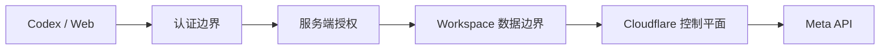
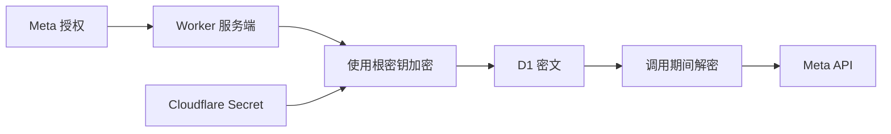

# 安全架构

> 候选实现：本页是将已批准 [SECURITY.md](../../SECURITY.md)映射到旧候选架构的草案。
> 安全政策继续有效，但具体组件和控制落点必须在产品形态确定后重做评审。

根目录 [SECURITY.md](../../SECURITY.md) 定义安全政策和不变量。本文描述目标技术控制，
不表示控制已经实现或验证。

## 保护资产

- Meta Token、OAuth Token 和加密根密钥。
- 广告账户数据、Workspace 成员关系和权限。
- 不可变变更 payload、审批身份和 TTL。
- before/after 快照、审计事件和幂等状态。
- 广告对象控制权及预算边界。

## 不可信输入

- Codex、MCP 和网页传入的所有参数。
- `workspace_id`、`ad_account_id`、对象 ID 和角色声明。
- Meta 响应、游标、错误、Webhook 和使用量 Header。
- 日期、breakdown、筛选器、导入和变更理由。
- 重放、过期或被篡改的变更申请。

## 信任边界

每个边界都必须独立验证；Cloudflare 账户身份不能替代业务租户授权。

## 威胁与控制

| 威胁 | 主要控制 | 需求 |
| --- | --- | --- |
| 水平越权 | 服务端成员查询、Workspace 过滤、对象绑定 | SEC-001、NFR-001 |
| Token 泄漏 | 服务端加密、Secret 隔离、日志脱敏 | SEC-002、SEC-009 |
| 任意外部请求 | schema、allowlist、无通用代理 | SEC-004 |
| 审批绕过 | 网页审批、不可变 payload、只接受 ID 的执行器 | SEC-005 |
| 重放或对象变化 | TTL、`before_hash`、幂等、状态机 | SEC-010 |
| 审计破坏 | 追加式事件、快照、受限写路径 | SEC-006 |
| 失控自动化 | Emergency stop、预算和操作白名单、安全缺省 | SEC-007 |
| 环境串用 | 独立 Secret 与数据资源、显式部署目标 | SEC-008 |

## Token 流程

明文只在服务端调用期间存在，不得写入持久化、日志、错误、浏览器或 Skill。

## 外部写控制

执行器必须同时验证：

- 独立授权允许 Meta 写入。
- 认证主体和 Workspace 权限。
- `APPROVED` 状态、真实审批者和 TTL。
- 不可变 payload、目标对象和 `before_hash`。
- 预算、白名单和账户策略。
- Emergency stop。
- 幂等键和历史执行结果。

任一验证失败即拒绝，不尝试“最佳努力”写入。

## 安全验证

最低安全测试包括：

- 水平越权和跨 Workspace ID 枚举。
- 任意 Graph path、URL/SSRF 和 SQL 注入。
- 日志、错误、快照和导出的凭据泄漏。
- 重放执行、审批者伪造和非法状态转换。
- MCP 参数绕过、日期/行数/指标限制绕过。
- Emergency stop、缺失策略和对象变化的安全失败。

仓库没有运行时代码，因此这些控制当前均为目标设计，不得在安全报告中描述为已存在。
